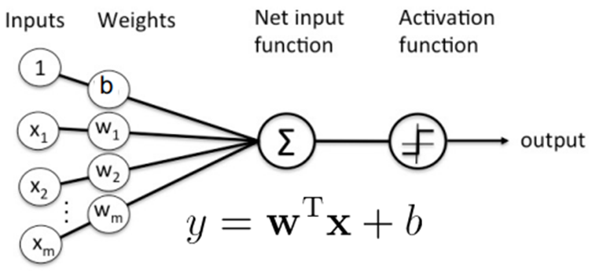

# 報告分數

40/40

# Demo Questions

1. 在 `update function` 時候，為什麼是 -=
```python
def update(self,learning_rate):
    if (self.weight_optimizer != None and self.bias_optimizer!= None ):
        self.W -= self.weight_optimizer.calc(learning_rate * self.dW)
        self.b -= self.bias_optimizer.calc(learning_rate * self.db)
    else:
        self.W -= learning_rate * self.dW
        self.b -= learning_rate * self.db
```

2. 為什麼在 `artifical nerual` 時需要 $+b$



3. 為什麼需要 activation function
