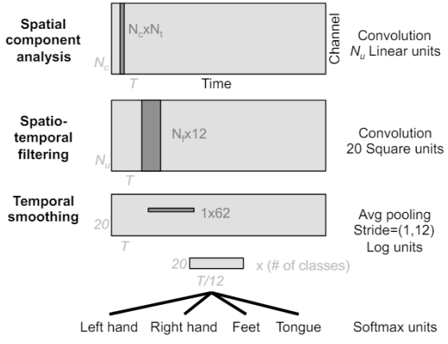

# 報告分數

33/35

# Demo Questions

```python
class SCCNet(nn.Module):
    def __init__(self, numClasses=4, timeSample=438, Nu=0, C=22, Nc=20, Nt=0, dropoutRate=0.5):

        super(SCCNet, self).__init__()
        # Zero-padding, batch normalization were applied to first and second conv
        # l2 regularization with coefficient 0.0001

        self.first_conv = nn.Conv2d(in_channels=1,out_channels=Nu,kernel_size=(C,Nt),padding=(0,0))
        first_conv_sz = self.get_conv_size(C,timeSample,in_channels=1,out_channels=Nu,kernel_size=(C,Nt),padding=(0,0))
        
        self.first_batch_norm = nn.BatchNorm2d(Nu)

        self.second_conv = nn.Conv2d(in_channels=Nu,out_channels=Nc,kernel_size=(1,12),padding=(0,6))

        second_conv_sz = self.get_conv_size(first_conv_sz[1],first_conv_sz[2],in_channels=Nu,out_channels=Nc,kernel_size=(1,12),padding=(0,6))
        
        self.second_batch_norm = nn.BatchNorm2d(Nc)
        self.second_square = SquareLayer()

        self.dropout = nn.Dropout(dropoutRate)
        self.pooling = nn.AvgPool2d(kernel_size=(1,62),stride=(1,12))
        pool_zx = self.get_pool_size(second_conv_sz[1],second_conv_sz[2],kernel_size=(1,62),stride=(1,12))
        
        self.log_activation = LogLayer()


        self.fc = nn.Linear(self.get_size(second_conv_sz[0],pool_zx[1]),numClasses)
        
    def get_conv_size(self,input_h,input_w,in_channels,out_channels,kernel_size,padding=(0,0),stride=(1,1)):
        kernel_size = list(kernel_size)
        padding = list(padding)
        stride = list(stride)
        return [out_channels,(input_h - kernel_size[0] + 2 * padding[0]) // stride[0] + 1 , (input_w - kernel_size[1] + 2 * padding[1]) // stride[1] + 1]
    
    def get_pool_size(self,input_h,input_w,kernel_size,padding=(0,0),stride=(1,1)):
        kernel_size = list(kernel_size)
        padding = list(padding)
        stride = list(stride)
        return  [math.floor( ( input_h - kernel_size[0] + 2 * padding[0] ) / stride[0]) + 1,
                 math.floor( ( input_w - kernel_size[1] + 2 * padding[1] ) / stride[1]) + 1]

    # if needed, implement the get_size method for the in channel of fc layer
    def get_size(self, C, N):
        return C*N
```

1. 解釋一下為什麼要用 第二層的 conv2d 還有 get_size 怎麼設計
2. conv2d spatial & temporal 差異

3. Nu 和資料集的關係